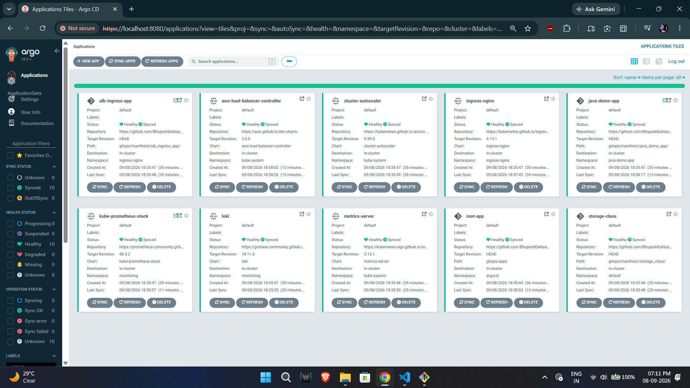
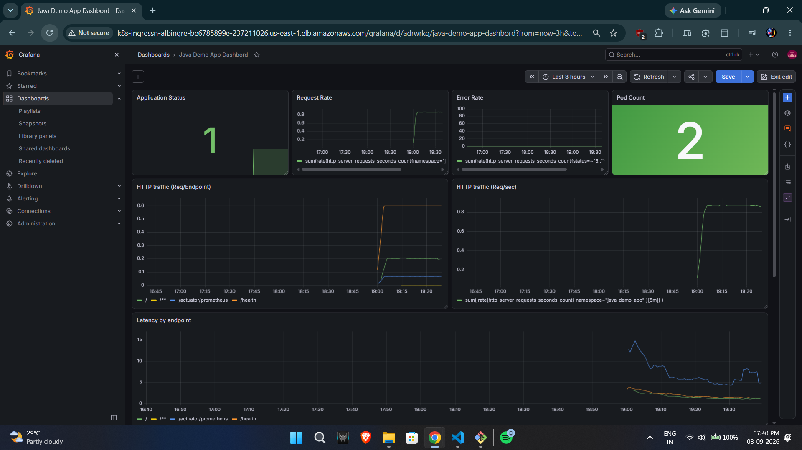
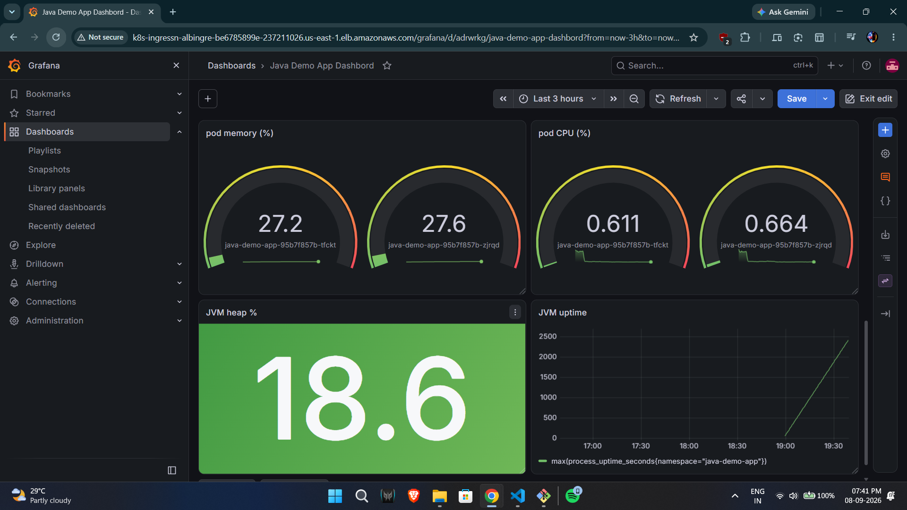
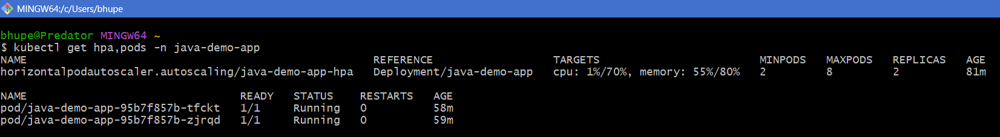
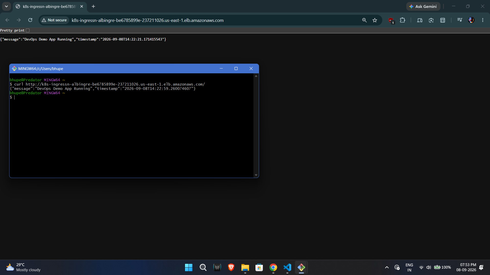
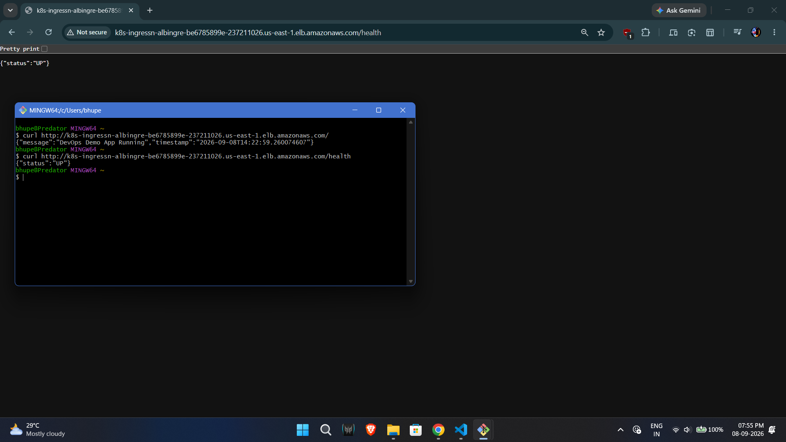

# Production Java on Amazon EKS

A production-style platform that deploys a Spring Boot application on Amazon EKS using modern DevOps practices: Infrastructure as Code, GitOps, EKS Pod Identity, and full observability.

This project demonstrates end-to-end ownership of a cloud-native platform — from networking and cluster provisioning to continuous delivery, autoscaling, and monitoring.

---

## App used to deploy

The application is a Spring Boot 3 (Java 21) REST API with full Postgres CRUD and Flyway-managed schema migrations. It exposes Prometheus metrics via Spring Actuator and uses structured JSON logging for Loki ingestion.

The CI/CD pipeline for the application lives in the app repository — GitHub Actions builds, tests, scans with Trivy, pushes to ECR, and automatically updates the image tag in this GitOps repo to trigger an Argo CD sync.

**Application repository:** [BhupeshDahiya/Demo_Java_app](https://github.com/BhupeshDahiya/Demo_Java_app)

## Architecture Overview

```text
Java App (App Repo)
    │
    ▼
GitHub Actions
    │  (build → test → Trivy scan → push to ECR → update GitOps repo)
    ▼
Amazon ECR
    │
    ▼
GitOps Repo (this repo)
    │
    ▼
Argo CD (App of Apps)
    │
    ├── AWS Load Balancer Controller
    ├── Cluster Autoscaler
    ├── Metrics Server
    ├── kube-prometheus-stack
    ├── Grafana Loki
    └── Java Demo Application
            │
            ▼
        Amazon EKS
            │
            ├── Managed Node Groups
            ├── EKS Pod Identity
            └── Application Load Balancer
```

**Application repository:** [Demo_Java_app](https://github.com/BhupeshDahiya/Demo_Java_app)

---

## Screenshots

### Argo CD - All applications synced


### Grafana Dashboard



### HPA Scaling under load


### Application running



---

## Key Features

- **Infrastructure as Code** — Terraform for VPC, EKS, ECR, IAM, RDS, and Pod Identity
- **GitOps** — Argo CD with App of Apps pattern
- **EKS Pod Identity** — Modern IAM integration (no OIDC/IRSA for workloads)
- **CI/CD** — GitHub Actions → ECR → automated GitOps updates
- **Autoscaling** — HPA (CPU/Memory) + Cluster Autoscaler
- **Observability** — Prometheus, Grafana, and Loki
- **Security** — Trivy scanning, least-privilege IAM, health probes, secrets never stored in cluster
- **Secrets Management** — AWS Secrets Manager + External Secrets Operator syncs DB credentials into Kubernetes
- **Managed Database** — Amazon RDS PostgreSQL with encrypted storage, Flyway migrations via init container
- **Environment separation** — Separate Terraform backends for dev / staging / prod

---

## Tech Stack

| Layer              | Technology                                      |
|--------------------|-------------------------------------------------|
| Cloud              | AWS                                             |
| Compute            | Amazon EKS (Managed Node Groups)                |
| Networking         | VPC, ALB (AWS Load Balancer Controller)         |
| Identity           | EKS Pod Identity                                |
| IaC                | Terraform                                       |
| GitOps             | Argo CD (App of Apps)                           |
| CI/CD              | GitHub Actions                                  |
| Container Registry | Amazon ECR                                      |
| Observability      | kube-prometheus-stack + Grafana Loki            |
| Application        | Spring Boot (Java 21)                           |
| Database           | Amazon RDS (PostgreSQL 18.6)                    |
| Secrets            | AWS Secrets Manager + External Secrets Operator |
| Autoscaling        | HPA + Cluster Autoscaler                        |

---

## Design Decisions

| Decision                        | Choice                         | Why |
|--------------------------------|--------------------------------|-----|
| Workload identity              | EKS Pod Identity               | Simpler than IRSA, no per-cluster OIDC provider, AWS recommended for new clusters |
| Infra vs cluster config        | Terraform + Argo CD            | Clear separation: Terraform owns cloud resources & IAM, Argo CD owns everything inside the cluster |
| Delivery model                 | GitOps (App of Apps)           | Declarative, auditable, self-healing |
| Compute                        | Managed Node Groups            | Required for Pod Identity Agent; simpler than self-managed nodes |
| Ingress                        | AWS ALB + NGINX Ingress        | ALB for AWS-native external entry; NGINX for in-cluster routing |
| Observability                  | Prometheus, Grafana & Loki     | Industry standard, full metrics & logs on dashboards |
| Database                       | Amazon RDS over in-cluster PostgreSQL | Managed service, automated backups, production-grade separation of concerns |
| Secrets management             | ESO + Secrets Manager over k8s Secrets | Encrypted at rest, auditable, no plaintext credentials in the cluster |

---

## What I Built

A complete production-style platform that continuously delivers a Spring Boot application to Amazon EKS using Infrastructure as Code and GitOps.

The platform includes Terraform-managed networking and EKS, Argo CD for declarative delivery, EKS Pod Identity for secure AWS access, GitHub Actions CI/CD, HPA + Cluster Autoscaler, and observability with Prometheus, Grafana, and Loki.

The application is intentionally simple so the focus remains on platform engineering and DevOps practices. It includes a full Postgres CRUD backend with Flyway-managed schema migrations, credentials injected securely via External Secrets Operator pulling from AWS Secrets Manager.

## Challenges & Lessons Learned

- **Destroy order matters** — Resources created by the AWS Load Balancer Controller (ALBs, target groups, security groups) must be cleaned up before `terraform destroy`, otherwise destruction can hang or leave orphaned resources.
- **Bridging Terraform and GitOps** — Some controllers need infrastructure values (such as VPC ID) that only exist after Terraform runs. Solved by rendering Argo CD Application manifests from Terraform templates.
- **Cost control** — EKS control plane and NAT Gateway costs add up quickly, so the environment is designed to be safely created and destroyed daily.

---

## Repository Structure

```text
prod-java-on-eks/
├── terraform/                  # Infrastructure as Code
│   ├── backends/               # S3 backend configs (dev/staging/prod)
│   ├── eks.tf
│   ├── vpc.tf
│   ├── ecr.tf
│   ├── iams.tf                 # Pod Identity roles & associations
│   ├── argocd.tf
│   └── ...
├── gitops/
│   ├── app of apps/            # Root Argo CD Application
│   ├── apps/                   # Individual Argo CD Applications
│   └── manifests/              # Kubernetes manifests / values
└── README.md
```

---

## Prerequisites

- AWS CLI configured with appropriate permissions
- Terraform >= 1.5
- kubectl
- Helm (optional, for debugging)
- An existing S3 bucket + DynamoDB table for Terraform state

---

## Getting Started

### 1. Clone the repository

```bash
git clone https://github.com/BhupeshDahiya/prod-java-on-eks.git
cd prod-java-on-eks/terraform
```

### 2. Initialize and apply Terraform

```bash
terraform init -backend-config="backends/dev.hcl"
terraform plan -var-file="environments/dev.tfvars"
terraform apply -var-file="environments/dev.tfvars"
```

### 3. Configure kubectl

```bash
aws eks update-kubeconfig --region <REGION> --name <CLUSTER_NAME>
```

### 4. Bootstrap Argo CD App of Apps

```bash
kubectl apply -f "../gitops/app of apps/root.yaml"
```

Argo CD will automatically sync all platform components and the application.

### 5. Access Argo CD

```bash
kubectl port-forward svc/argocd-server -n argocd 8080:443
```

Get the initial admin password:

```bash
argocd admin initial-password -n argocd
```

---

## Destroying the Environment

Order matters because of AWS Load Balancer Controller resources.

```bash
# 1. Delete application & related namespaces first
kubectl delete namespace java-demo-app
kubectl delete namespace ingress-nginx
kubectl delete namespace monitoring

# 2. Wait until namespaces are fully terminated
kubectl get namespaces

# 3. Remove Argo CD
kubectl delete namespace argocd --force

# 4. Verify no leftover ALBs / Target Groups
aws elbv2 describe-load-balancers --query 'LoadBalancers[*].LoadBalancerArn' --output table
aws elbv2 describe-target-groups --query 'TargetGroups[*].TargetGroupArn' --output table

# 5. Destroy infrastructure
cd terraform
terraform destroy -var-file="environments/dev.tfvars"
```

---

## Cost Notes

Approximate monthly cost for a small dev setup (us-east-1):

| Resource                    | Approx. Cost |
|----------------------------|--------------|
| EKS Control Plane          | ~$73         |
| t3.medium nodes (x2)       | ~$60         |
| NAT Gateway + data         | ~$35-50      |
| ALB                        | ~$20+        |
| ECR + misc                 | low          |
| RDS db.t3.micro            | ~$15         |

**Tips to reduce cost:**
- Scale the node group to 0 when not in use
- Destroy the environment when idle
- Use smaller instance types for pure demos

---

## Application

The demo application is a Spring Boot service with Postgres CRUD and full observability:

- `GET /` — status + timestamp
- `GET /health` — health check
- `GET /logs-test` — generates test logs
- `GET /validate` — basic input validation
- `POST/GET/PUT/DELETE /persons` — CRUD operations backed by RDS PostgreSQL
- Prometheus metrics via Spring Actuator
- Schema managed by Flyway migrations

Source: [BhupeshDahiya/Demo_Java_app](https://github.com/BhupeshDahiya/Demo_Java_app)

---

## Future Improvements

- NetworkPolicies / Pod Security Standards
- AWS Budgets + cost anomaly detection
- Terraform plan checks in CI for this repository
- Multiple environment promotion (dev → staging → prod)
- Optional tracing (Tempo or AWS X-Ray)
